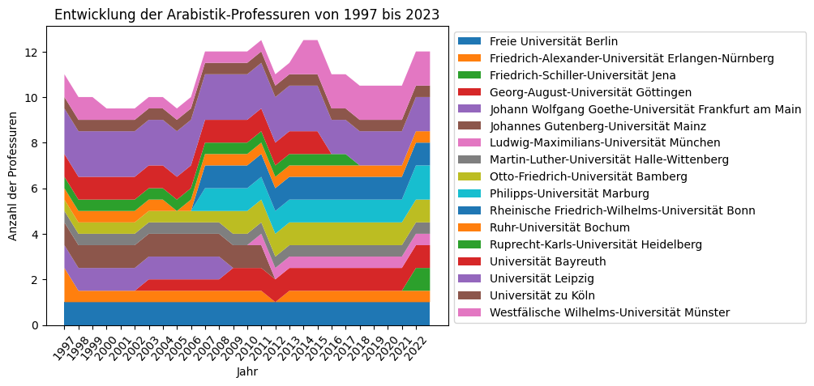

### Universitäten, Institute und Professuren

Im Jahr 2023 gibt es in Deutschland insgesamt 13 Standorte mit Instituten, die ausschließlich oder teilweise mit der Bezeichnung "Arabistik" arbeiten. In der Summe sind an diesen 12 unbefristete Professuren eingerichtet.[^1] In der Entwicklung seit 1997 hat sich dabei kaum etwas an dieser Zahl geändert, wobei an vier Standorten Professuren und damit die Fachinstitute `TODO: ist das wirklich so?`
aufgelöst wurden, an fünf Standorten dafür aber Professuren geschaffen wurden, an denen vorher keine ständige Professur unterhalten wurde.[^2] 

Mit dieser Zahl bewegt sich das Fach auf Platz 66 von 164 aller Fächer, die durch die Arbeitsstelle Kleine Fächer als "Kleines Fach" kategorisiert wurden.

---
[^1]: [Arbeitsstelle Kleine Fächer](https://www.kleinefaecher.de/kartierung/kleine-faecher-von-a-z?tx_dmdb_monitoring%5Baction%5D=showByLocations&tx_dmdb_monitoring%5Bcontroller%5D=DisciplineTaxonomy&tx_dmdb_monitoring%5BdisciplineTaxonomy%5D=11&cHash=33379167a96f5dadb20baa1aee6d403a#overview) (2023-08-16)
[^2]: [Arbeitsstelle Kleine Fächer](https://www.kleinefaecher.de/kartierung/kleine-faecher-von-a-z?tx_dmdb_monitoring%5Baction%5D=showByLocations&tx_dmdb_monitoring%5Bcontroller%5D=DisciplineTaxonomy&tx_dmdb_monitoring%5BdisciplineTaxonomy%5D=11&cHash=33379167a96f5dadb20baa1aee6d403a#people) (2023-08-16)
