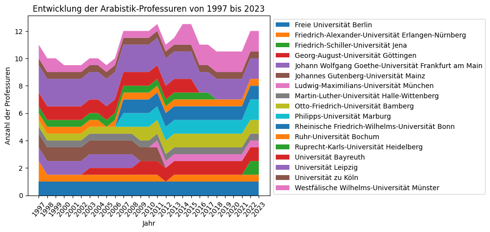

### Universitäten, Institute und Professuren

Im Jahr 2023 gibt es in Deutschland insgesamt 13 Standorte mit Instituten, die ausschließlich oder teilweise mit der Bezeichnung "Arabistik" arbeiten. In der Summe sind an diesen 12 unbefristete Professuren eingerichtet.[^1] In der Entwicklung seit 1997 hat sich dabei kaum etwas an dieser Zahl geändert, wobei an vier Standorten Professuren und damit die Fachinstitute aufgelöst oder in andere Institute eingegliedert wurden, an fünf Standorten dafür aber Professuren geschaffen wurden, an denen vorher keine ständige Professur unterhalten wurde.[^2] 

In Frankfurt am Main wurde 2009 das "Orientalisches Seminar" `#TODO: Quelle` geschlossen. In Mainz lässt sich Arabisch im Jahr 2023 nur noch als Teil des BA und MA Translation studieren, ein dezidiertes Institut gibt es hier nicht mehr. In Heidelberg gab es laut der Arbeitsstelle Kleine Fächer bis 2017 eine halbe Professur für Arabistik, das "Seminar für Sprachen und Kulturen des Vorderen Orients" verfügt heute nur noch über Abteilungen für Assyriologie, Islamwissenschaft und Semitistik. Letztere "überblickt in einzelsprachlicher und komparativer Perspektive die ganze semitische Sprachfamilie mit den primären Quellensprachen Arabisch (Klassisches Arabisch, Modernes Hocharabisch, gesprochene Dialekte), Aramäisch (ältere und moderne Varietäten) sowie Gǝʿǝz (Altäthiopisch)"[^3] und ist damit nicht mehr spezifisch eine auf die arabische Sprache und erst recht nicht auf die arabische Literatur(geschichte) fokussierte Abteilung. In Bayreuth gibt es den Lehrstuhl für Arabistik noch, allerdings mit nur einer Junior-, nicht mit einer ständigen Professur.[^4]

Doch es wurden nicht nur Stellen gestrichen: In Jena, Marburg, Göttingen, München und Bonn wurden seit 1997 insgesamt 5 1/2 Professuren geschaffen. Damit blieb die Gesamtzahl der Professuren in den der Arabistik zugerechneten Instituten etwa auf einem stagnierenden Level, mit einem auffälligen Ausschlag nach oben um die Jahre 2011 und 2014 herum. `#TODO: Inwieweit hängt das mit der politischen Entwicklung zusammen?` Mit 13 Standorten und 12 unbefristeten Professuren bewegt sich das Fach auf Platz 66 von 164 aller Fächer, die durch die Arbeitsstelle Kleine Fächer als "Kleines Fach" kategorisiert wurden.

Die reine Anzahl der unbefristeten Professuren gibt aber für sich genommen wenig Auskunft über die tatsächliche Lage der Arabistik in Deutschland. Das liegt zum Einen daran, dass die unbefristete Professur auf das gesamte wissenschaftliche Personal gerechnet die absolute Minderheit ist. An der Freien Universität Berlin gibt es etwa neben der ständigen Professorin eine befristete ERC-Professorin, einen Juniorprofessor und drei Honorarprofessor:innen, weiterhin eine Lektorin und zwei wissenschaftliche Mitarbeiter:innen. Andererseits ist das deutsche Hochschulsystem nach wie vor stark auf die leitenden Professor:innen ausgerichtet, die damit einen starken Einfluss auf die Entwicklung der Lehr- und Forschungsschwerpunkte am Institut haben.

---
[^1]: [Arbeitsstelle Kleine Fächer](https://www.kleinefaecher.de/kartierung/kleine-faecher-von-a-z?tx_dmdb_monitoring%5Baction%5D=showByLocations&tx_dmdb_monitoring%5Bcontroller%5D=DisciplineTaxonomy&tx_dmdb_monitoring%5BdisciplineTaxonomy%5D=11&cHash=33379167a96f5dadb20baa1aee6d403a#overview) (2023-08-16)
[^2]: [Arbeitsstelle Kleine Fächer](https://www.kleinefaecher.de/kartierung/kleine-faecher-von-a-z?tx_dmdb_monitoring%5Baction%5D=showByLocations&tx_dmdb_monitoring%5Bcontroller%5D=DisciplineTaxonomy&tx_dmdb_monitoring%5BdisciplineTaxonomy%5D=11&cHash=33379167a96f5dadb20baa1aee6d403a#people) (2023-08-16)
[^3]: https://www.ori.uni-heidelberg.de/semitistik/ (2023-08-17)
[^4]: https://www.arabistik.uni-bayreuth.de/de/team/index.html (2023-08-18)